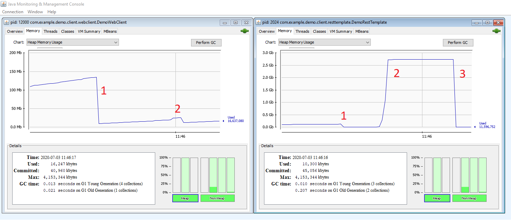

# RestTemplate-vs-WebClient

Simple project to show the difference in memory usage of [Springs](https://spring.io/) RestTemplate and WebClient APIs.

## Experiment

1. Start the `DemoServer`, `DemoRestTemplate` and `DemoWebClient` applications.
1. Start `jconsole -interval=1` and attach to both client applications.
1. Perform a GC on both clients.
1. Type the absolute path to a file (in this case 550MB) in the client CLIs and press Enter.
1. Wait a couple of seconds and perform a GC for the `DemoRestTemplate` application.

## Observation
For some reason the `RestTemplate` uses an excessive amount of memory (take the differently scaled y-axis into account) and creates a **lot** of garbage in the old generation.
 

1. The initial manual GC
2. The request
3. The manual GC

## Hypothesis
It looks like the `RestTemplate` creates multiple copies of the complete file (memory usage is roughly 5x file size) while the `WebClient` creates just some helper objects and a buffer which it frees correctly after use.
